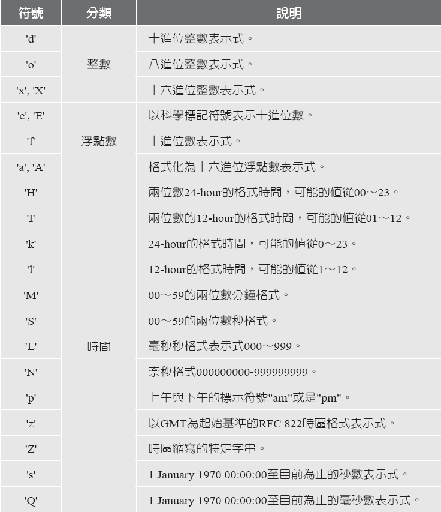

String
======
## Outline

- [前言](#前言)

- [字串類別](#字串類別)
	+ [String](#string)
 		* [String函式](#string函式)

	+ [StringBuilder](#stringbuilder)
		* [StringBuffer](#stringbuffer)
		* [使用時機](使用時機)
- [格式化輸出](#格式化輸出)
	+ [Formatter](#Formatter)
	+	*[Demo Date](#Demo Date)
- [正規表示式](#正規表示式)
- 	+ [撰寫正規表示式](#撰寫正規表示式)
- 		* [Demo RegularExpression](#Demo RegularExpression)
- [Scanner類別](#Scanner類別)
	+ [StringTokenizer](#stringyokenizer)

## 前言
字串是一種使用非常頻繁的資料型態。字串可以被視為一連串的字元所組合而成的資料型態。在「String」類別中擁有許多的方法可以被用來處理字串。
以下將介紹常使用的字串類別及其相關的工具。

##字串類別

###String
利用String類別建構出來的物件的內容是無法變動的(Immutable)，也就是說，一旦建立字串後，就無法改變其值，只能重新指定成新的字串值或另一個字串變數。

####String函式
由於String使用上得頻繁，請自行瀏覽SDK文件中關於「java.lang」套件的String類別的相關方法，常用的方法有：


```
public class StringEX {

	
	public static void main(String[] args) {
		String str = "A Dog ";
		System.out.println(str.length());                    //6
		System.out.println(str.concat("!"));                 //A dog !
		System.out.println(str.trim());                      //A dog
		System.out.println(str.indexOf("d"));                //2
		System.out.println(str.charAt(3));                   //o
		System.out.println(str.substring(2,5));              //dog
		System.out.println(str.replace("dog","cat"));        //A cat
		System.out.println(str.equalsIgnoreCase("A DOG "));  //true
		System.out.println(str.startsWith("A"));             //true
		System.out.println(str.endsWith("dog"));             //true
		System.out.println(str.toLowerCase());               //a dog
		System.out.println(str.toUpperCase());               //ADOG
		System.out.println(str);                             //A dog 
	}

}

```

###StringBuilder
- 最主要的用途在於字串的新增、刪除、修改等操作
- 使用'+'來串接字串，但'+'會產生一個新的String實例 
- 不建議使用'+'來進行字串的串接，建議先以StringBuilder串接字串
- 文字的串接必須要用append() 或 insert() 方法
- 減少垃圾量，提高效能

```
public class StringBuilderEx {

	public static void main(String[] args) {
		StringBuilder sb = new StringBuilder("A dog");
		System.out.println(sb.append("!"));
		System.out.println(sb.insert(2, "barking "));
		
		int beginIndex = sb.indexOf("bark");
		int endIndex = sb.indexOf("!");
		System.out.println(sb.replace(beginIndex, endIndex, "meowing cat"));
		
		beginIndex = sb.indexOf("meow");
		endIndex = sb.indexOf("cat");
		System.out.println(sb.delete(beginIndex, endIndex));
		
		System.out.println(sb.substring(2, sb.length()));

	}

}
```

####StringBuffer
StringBuilder隨著Java SE5時問世。在此之前，Java適用的是StringBuffer，他保證跨執行緒的安全性(請參見並行性一章)，所使用代價較高。

####使用時機
StringBuilder 與 StringBuffer 的使用時機
- 非多執行緒環境 → StringBuilder 具較高執行效率
  + 因為StringBuilder不會處理同步問題
- 多執行緒環境 → StringBuffer 確定可以正常運作

##格式化輸出
簡單Demo格式化輸出差別

```
public class SimpleFormat {
	
	public static void main(String[] args) {
		int x = 3;
		double y =3.123689;
		//The old way
		System.out.println("S1: ["+x+" "+y+"]");
		//The new way
		System.out.printf("S2: [%d %f]\n", x, y);
		System.out.format("S3: [%d %f]\n", x, y);

	}

}
```

###Formatter


為了控制資料被插入時的空白及對齊，以下是通用語法:
```
%[argument_index$] [flage] [width] [.precision] conversion
```
語法中「%」和「conversion」這兩部份是必要的參數。Conversion使用一個字元來
表示，用來指定資料型態。

Conversion六種格式化類型:
- 一般(General):可以用來輸出任何的資料型態。
- 字元(Charaster):可用來輸出char、Charaster、Byte、short、Short等類型的資料。        
  但也可以利用使用「Charaster.isValidCodepoint(int)」方法來輸出int或是lnteger   
  型別的資料。
- 數字(Numeric):可以用來輸出byte、Byte、short、Short、int、lnteger、long、Long、
   float、Float、double、Double型別的資料。
- 日期/時間(Date/Time):可以用來輸出date、time、long、Long、Calendar、Date型
  別的資料。
- 百分比(Percent):輸出%型態的資料。
- 換行符號(Line Separator):輸出換行符號。



```
public class FormatNumber {
	public static void main(String[] args) {
		StringBuilder sb = new StringBuilder();
		Formatter formatter = new Formatter(sb);
		formatter.format("數字 = %d%n",30);
		formatter.format("20八進位 = %o%n",20);
		System.out.println(sb);
		
		//直接printf
		System.out.printf("數字 = %d%n20八進位 = %o%n",30,20);
	}

}
```

####Demo Date

當程式中使用「t」或是「T」來顯示日期或時間的格式時，我們還必需要設定實際格式的顯示方式。「t」或是「T」只是前導字元，1u4vm 
加上日期或時間專屬的conversion字元。
```
public class FormatDate {

	public static void main(String[] args) {
		Date date = new Date();
		String s = String.format("use format : %1$tm/%1$td/%1$tY", date);
		System.out.println(s);
		
		System.out.printf("use printf : %1$tm/%1$td/%1$tY", date);

	}

}
```
##正規表示式
使用時機
- 想限制使用輸入的格式、長度，例如：輸入身份證字號、電話號碼
- 為利後續資料的處理，當使用者輸入時即進行資料形式的比對
- 如果要寫一支程式比對使用者輸入的電子郵件帳號是否符合
  + 檢查字串中是不是有 『 @ 』符號，且確定其只出現一次
  + 檢查帳號是不是數字開頭
 
matches() 方法，可協助正規表示式來達到檢查使用者輸入的資料是不是符合系統要求

簡單Demo
```
public class InterMatch {
	public static void main(String[] args) {
		//描述可能有負號，然後接著一個或多個數字
		System.out.println("-123".matches("-?\\d+"));
		System.out.println("456".matches("-?\\d+"));
		//有+是合理的，但不符合正規表示式
		System.out.println("+789".matches("-?\\d+"));
		//必須(-|\\+)的表示法
		//(-|+)是錯誤的，因為"+"在正規表示式中有特殊定義
		System.out.println("+789".matches("(-|\\+)?\\d+"));
	}

}
```
###撰寫正規表示式
提供「正規運算式」來進行字串的比對、選取、編修、檢驗，相關的處理類別是放在「java.util.regex」套件中，只有兩個類別:「Matcher」和「Pattern」。
- 「Matcher」類別是利用pattern來比對字串
- 「Pattern」類別用來設定正規運算式


如果要建立pattern，需要透過「compiler」方法將字串轉換為pattern。利用該pattern來建立Matcher物件，並可以利用相關的方法來進行資料的比對工作。參考以下的範例：

```
public class Regular {

	public static void main(String[] args) {
		 Pattern pat;
         Matcher mat;
         Boolean found;

         pat = Pattern.compile("Java");   //建立要比對的pattern
         mat = pat.matcher("Java");       //pattern要和「Java」字串來比
         found = mat.matches();           //看pattern是否和「Java」字串完全相同

         if (found)
                 System.out.println("第一次比對成功");
         else
                 System.out.println("第一次比對失敗");

         mat = pat.matcher("Java 2");     //pattern要和「Java 2」字串來比
         found = mat.matches();           //看pattern是否和「Java 2」字串完全相同

         if (found)
                 System.out.println("第二次比對成功");
         else
                 System.out.println("第二次比對失敗");

         found = mat.find();              //看pattern是否含在「Java 2」字串中

         if (found)
                 System.out.println("第三次比對成功");
         else
                 System.out.println("第三次比對失敗");
	}

}
```


####Demo RegularExpression

```
public class RegularExpression {

	public static void main(String[] args) {
		Scanner scanner = new Scanner(System.in);
		 
        String str = "abcdefgabcabc"; 
        System.out.println(str.replaceAll(".bc", "###")); 
 
        System.out.print("輸入手機號碼: "); 
        str = scanner.next();
 
        // 簡單格式驗證 
        if(str.matches("[0-9]{4}-[0-9]{6}")) 
            System.out.println("格式正確"); 
        else 
            System.out.println("格式錯誤");
 
        System.out.print("輸入電子郵件: "); 
        str = scanner.next();
 
        // 驗證電子郵件格式 
        if(str.matches(
        "^[_a-z0-9-]+([.][_a-z0-9-]+)*@[a-z0-9-]+([.][a-z0-9-]+)*$"))
            System.out.println("格式正確"); 
        else
            System.out.println("格式錯誤"); 
	}

}
```


##Scanner類別
主用在做格式化的輸入工作。利用Scanner類別中提供的方法，我們可以直接將檔案中的資料讀入，並轉成所需要的資料型態而不用再透過Wrapper Class的轉型。
- 將掃瞄進來的文字做分割，預設使用空白字元分割
- 可使用正規運算式，將符合格式的文字當作分割依據
- 並可搭配hasNext()與next()、nextInt等方法將值取出
- 
```
public class ScannerEx {

	public static void main(String[] args) {
		String str = "1,3,5,7,9";
		Scanner scan = new Scanner(str);
		scan.useDelimiter("\\s*,\\s*");
		while(scan.hasNextInt()) //判斷是否有下個字符
		System.out.println(scan.nextInt());
	
		
	}

}
```

###StringTokenizer
- 可以將一個長字串分解成多個子字串
- 已被Scanner取代


